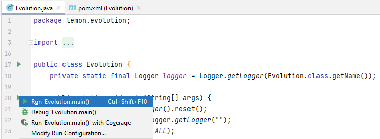
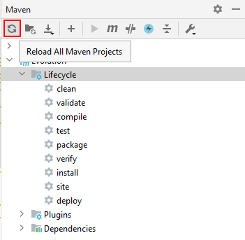
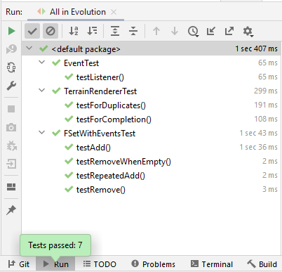

Getting Started
===============

Setting up the Development Environment
--------------------------------------
* Install IntelliJ (https://www.jetbrains.com/idea/)
  * Install the Community edition (and not Ultimate)
* Install Git (https://git-scm.com/downloads)
* Setup SSH Key (https://docs.github.com/en/enterprise-server@3.0/github/authenticating-to-github/connecting-to-github-with-ssh/generating-a-new-ssh-key-and-adding-it-to-the-ssh-agent)
  * Alternatively, use https://support.atlassian.com/bitbucket-cloud/docs/set-up-an-ssh-key/
    * Instead of Step 3, paste your public key here: https://github.com/settings/keys
* Install Java 16 JDK (or higher)
  * https://www.oracle.com/java/technologies/downloads/#java16
* Open up the terminal (or Git Bash) and navigate to where your environment will be and clone the Evolution repo
  * `git clone git@github.com:awesomelemonade/Evolution.git`
* Import project (File -> New -> Project from Existing Sources -> Select Evolution/pom.xml)
  * In IntelliJ, set the Project SDK to the downloaded Java 16 JDK
    * File -> Project Structure -> Project Settings -> Project -> Project SDK
* Run project
  * Open up `src/main/java/lemon/evolution/Evolution.java` in IntelliJ
  * Click on the green arrow to the left of the main method -> Run 'Evolution.main()'
    * 
  * If you run into any library errors, try the following
    * Restart IntelliJ
    * Refresh Maven (View -> Tool Windows -> Maven)
      * Click on "Reload All Maven Projects"
        * 
    * Add the following line (choose the one corresponding to your OS) after the `<lwjgl.version>` line in pom.xml
      * Windows: `<lwjgl.natives>natives-windows</lwjgl.natives>`
      * Mac: `<lwjgl.natives>natives-macos</lwjgl.natives>`
      * Linux: `<lwjgl.natives>natives-linux</lwjgl.natives>`
      * Refresh Maven (See the previous item)
  * For Mac users, we need to enter "-XstartOnFirstThread" as a JVM flag (NOT as a program argument)
    * Click on Run -> Edit Configuration
	* Click on "Modify options" (which is under Build and run)
	  * Java -> Add VM options
	  * Paste "-XstartOnFirstThread" in the "VM options" textbox
  * A successful run should pop up the menu screen (which is currently a black screen with three white rectangles)
    * Don't worry about "Unknown Key: " - it is OK
	* Click on the first rectangle, wait for the loading bars, and the world should pop up
* Run tests
  * Open up IntelliJ's project explorer
  * Right click src/test/java -> Run 'All Tests'
    * 
  * A successful run should look something like this
    * 
* To update the code from GitHub (also known as remote)
  * `cd path/to/Evolution/`
  * `git pull origin master`

Trello Guide
------------
Red = Bug, Orange = On Hold, Blue = Large Task, Purple = Small Task

Categories
* New: Items that have not been seen yet.
* Prioritized: Items that have been seen (and color labeled)
* Selected for Dev: Items that are prioritized to be done in the near future
* In Progress: Items that someone is working on
* Completed: Items that are completed

Feel free to add anything to the "New" category. Any item that is not "on hold" can be worked on if you are interested in it.

Merging your work
-----------------

* Create a new branch
  ```
  git branch <name-of-branch>
  git checkout <name-of-branch>
  ```
* Commit
  ```
  git add <file-path>
  git add <file-path2>
  ...
  git commit -m '<message>'
  ```
  * Pro Tip: You can use `git add .` to add everything. Ensure that you added only the files you want with `git status`
* Push
  ```
  git push origin <name-of-branch>
  ```
* Create a pull request
  * Go to https://github.com/awesomelemonade/Evolution/pulls
  * New pull request -> Select \<name-of-branch>
  * Request Code Review
  * Ensure no unit tests are failing (results should be shown on your PR page)
