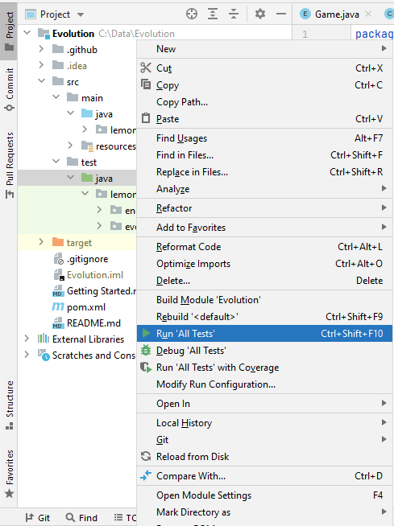

Getting Started
===============

Setting up the Development Environment
--------------------------------------
* Install IntelliJ (https://www.jetbrains.com/idea/)
* Install Git (https://git-scm.com/downloads)
* Setup SSH Key (https://support.atlassian.com/bitbucket-cloud/docs/set-up-an-ssh-key/)
  * You should see a private key (id_rsa) and a public key (id_rsa.pub)
  * Paste your public key here: https://github.com/settings/keys
* Navigate to where your environment will be and clone the Evolution repo
  * `git clone git@github.com:awesomelemonade/Evolution.git`
* Import project (File -> New -> Project from Existing Sources -> Select Evolution/pom.xml)
* Run project
  * Open up `src/main/java/lemon/evolution/Evolution.java` in IntelliJ
  * Click on the green arrow to the left of the main method -> Run 'Evolution.main()'
* Run tests
  * Open up IntelliJ's project explorer
  * Right click src/test/java -> Run 'All Tests'
    * 

Trello Guide
------------
Red = Bug, Orange = On Hold, Blue = Large Task, Purple = Small Task

Categories
* New: Items that have not been seen yet.
* Ideas: Items that have been seen (and color labeled)
* Selected for Dev: Items that are prioritized to be done in the near future
* In Progress: Items that someone is working on
* Completed: Items that are completed

Feel free to add anything to the "New" category. Any item that is not "on hold" can be worked on if you are interested in it.
